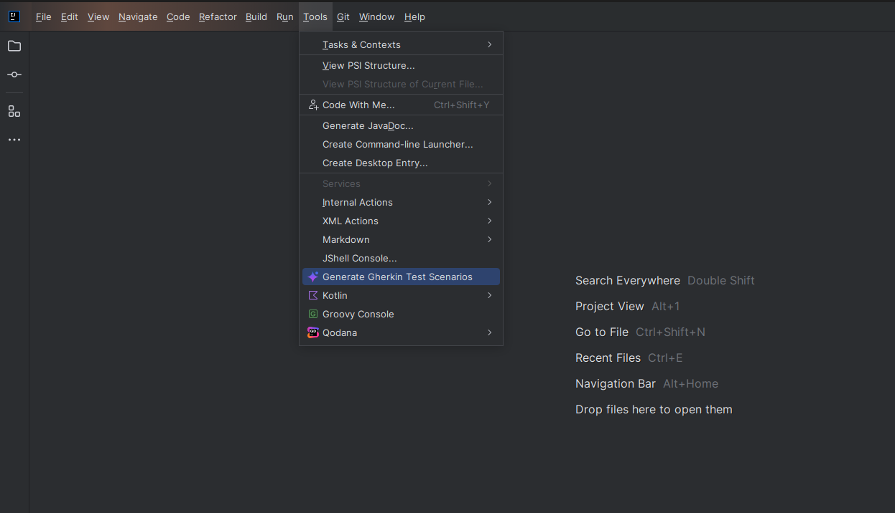
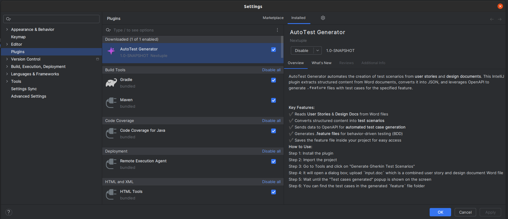

# AutoTest Plugin

## Plugin Description
AutoTest is a test case generation plugin which takes user stories and design docs as input in docx format and uses OpenAI to generate test scenarios in Gherkin format file (.feature) for the feature which the docx contains user story and design doc.





### Key Features:
- Reads detailed stories and design docx properly from Word to generate scenarios
- We have two features: normal generation and deep search. Deep search will generate more scenarios than the normal one
- Converts structured content into **test scenarios**
- Generates **.feature files** for behavior-driven testing (BDD)
- Saves the feature file inside your project for easy access
- Shows real-time progress of the entire flow: file upload, generating test cases, and writing test cases in the file


## Project Local Setup Guide

### Clone the Project
Clone this project from the clone option:
```sh
  git clone <repository-url>
  cd auto-test
```
### Add Secrets
 Add a secrets.yml file in the src/main/resources directory and add the following variables in this file:
```sh
 AZURE_API_KEY: YOUR_OPEN_AI_API_KEY
 AZURE_ENDPOINT: YOUR_OPEN_AI_ENDPOINT
```

### Build the Project
Build the project using the gradlew build command:
```shell
  ./gradlew build
```

### Run the Plugin
Run the plugin using the following command:
```shell
  ./gradlew runIde
```

### How to Use:
1. Install the plugin
2. Import the project
3. Go to Tools and click on "Generate Gherkin Test Scenarios"
4. A dialog will open and ask to provide the feature name which will be used to generate the Gherkin file with the feature name later.
5. After providing the feature name, it will open a dialog box; upload `.docx` file  which is a combined user story and design document.
6. Wait until the "Test cases generated" popup is shown on the screen, indicating that the test cases have been successfully generated.
7. You can find the test cases in the generated `generated-features` file folder

